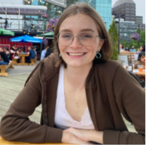

# Brynn Harris-Shanks

## Hello!
As a third year Neuroscience major as Dalhousie University I am completing a research project under Dr. Aaron Newman and Daniel Godfrey. The project  I am taking Neural Data Science (NESC 3505) strengthn my coding skills and to apply them to my current, as well as future projects. In this course we have worked with Pandas, Seaborn, and MatPlotLib to visualize, explore, and understand data from a single neuron, EEG, and MRI. This portfolio will outline some of my work in this course and demonstrate my coding skills.

check out this [merging demo](reading_files2.md).

check out how I [clean data](cleaning_data.md).

How I plot [histograms](plotting_data.md).

Here is how I manage data from a [single neuron](single_unit.md). 

