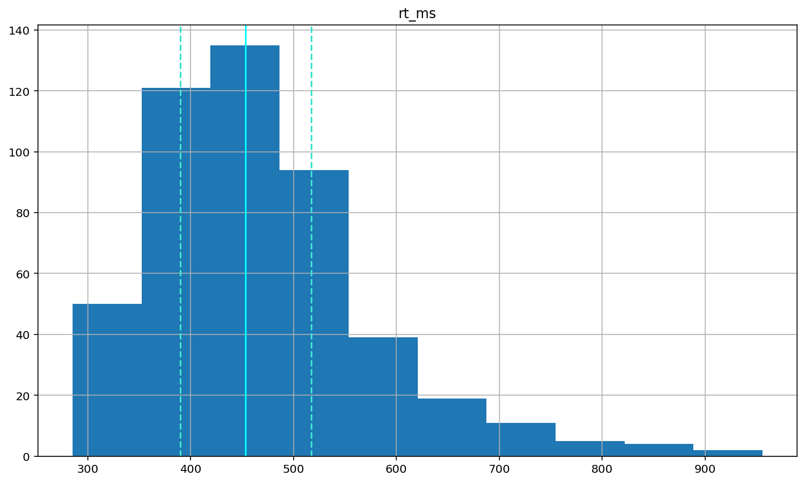
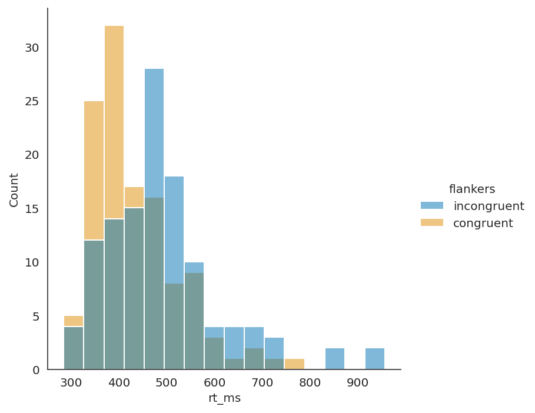

# How to plot histograms
## Pandas Histogram
### Import Pandas

Below I am importing pandas under the alias pd. Not shown here is the creation of the pandas DataFrame df, used throughout the assignment.


```python
import pandas as pd
```

### Plotting the data
Next, I plot the rt_ms column as a histogram using df.hist(). Some of the code plotting a line on the median and whisker values was already provided for me.


```python
# My code
df.hist(column = 'rt_ms')


# Code provided to me in the assignment
plt.axvline(df['rt_ms'].describe()['25%'], 0, 1, color='turquoise', linestyle='--')
plt.axvline(df['rt_ms'].median(), 0, 1, color='cyan', linestyle='-')
plt.axvline(df['rt_ms'].describe()['75%'], 0, 1, color='turquoise', linestyle='--')

plt.show()
```


    

    


The long tail of data on the right shows that this data is right skewed. If it were normally distributed most of the data would be closer to the median line, with two similar and shorter tails on both sides.

## Seaborn Histogram
### Import seaborn
Here I import seaborn under the alias sns and set the style to white


```python
import seaborn as sns
sns.set_style('white')
```

### Plotting the data
I plot the data in the DataFrame df with seaborn. Setting the X-axis to be the rt_ms column of df. I specified with the hue argument to plot the data from each flanker condition over top of each other and set the colour to colorblind so we can see the difference between the two. 


```python
sns.displot(data = df, 
            x = "rt_ms", 
            hue = 'flankers', 
            palette = 'colorblind'
           )

plt.show()
```


    

    


As you can see the congruent condition is in orange, the incongruent condition is in blue, and the green/gray area is where the overlap. Both conditions seem to be slightly skewed to the right. Unsurprisingly, the trials under the incongruent condition seem to be slower than those of the congruent.
