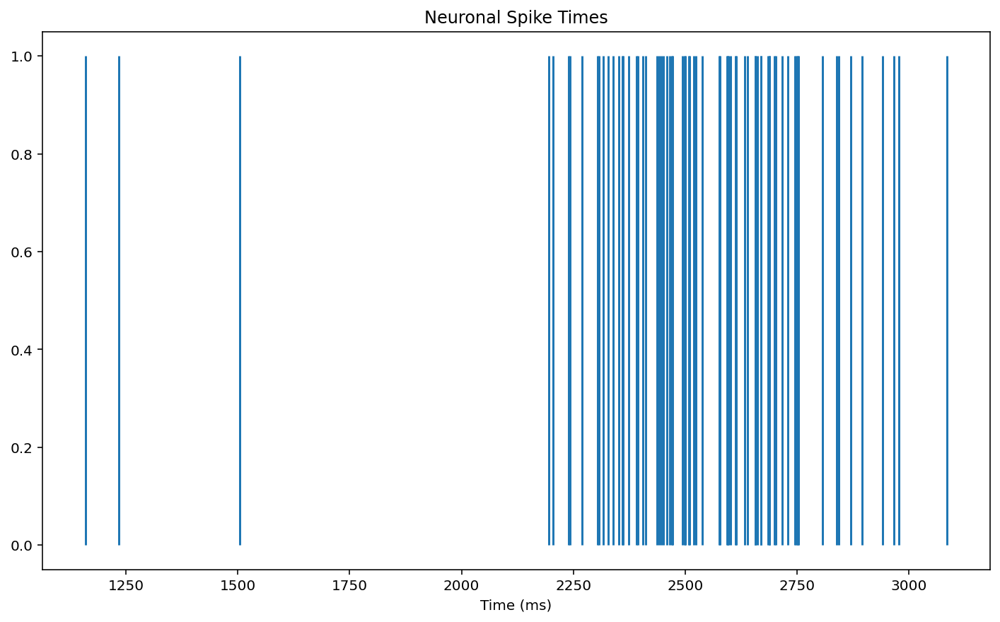
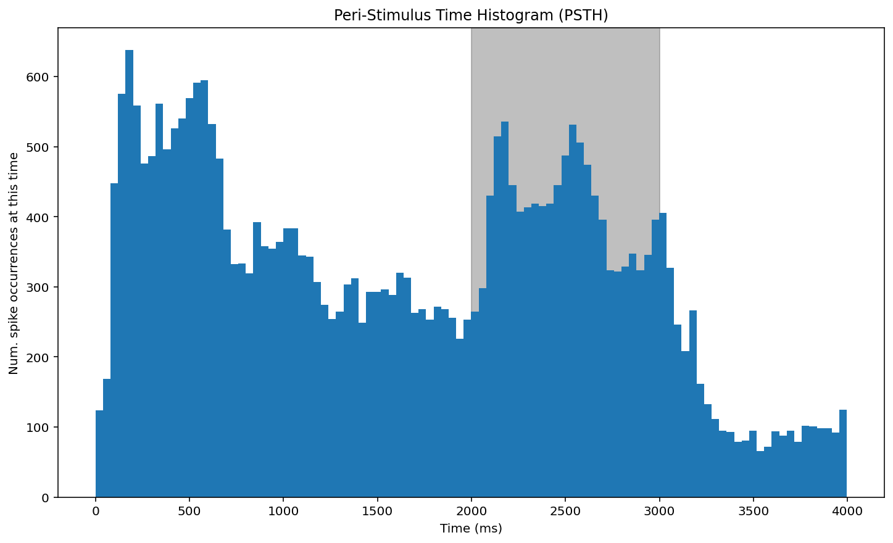

# Extracting and plotting single unit data
## Take a look at the complete data
In assignment 4, I created a DataFrame called data, which contains the data collected from each probed neuron during each trial.


```
print(data.sample(20))
```

           neuron  spiketime  repetition  contrast condition  trial
    12415   m2_13        709           5        64     ADAPT  12415
    25908   m4_17       2606           7        64     ADAPT  25908
    26274   m4_17         90           7        84     ADAPT  26274
    12913   m2_13       1018           1       100     ADAPT  12913
    22095   m4_17       2797           7        24      CTRL  22095
    14277    m3_3       2836           1        48      CTRL  14277
    29737  m6_17b       2125           3        16     ADAPT  29737
    29013  m6_17b       1504           1         8     ADAPT  29013
    30923  m6_17b       1063           2        64     ADAPT  30923
    28668  m6_17b       2143           8       100      CTRL  28668
    1294     m1_6        643           8        32     ADAPT   1294
    1988     m2_9       1559           2         4      CTRL   1988
    2581     m2_9       2374           7        12      CTRL   2581
    22780   m4_17       2626           8        64      CTRL  22780
    27479  m6_17b       2608           5        48      CTRL  27479
    2567     m2_9       2052           7        12      CTRL   2567
    10269   m2_13       2492           8        84      CTRL  10269
    15319    m3_3       2418           7       100      CTRL  15319
    1635     m1_6        269           1        84     ADAPT   1635
    27280  m6_17b       2217           4        32      CTRL  27280


## Look at the data from a single neuron
To be able to plot the data from a single neuron I first had to extract the data from only that neuron from the DataFrame. I further extracted the trials where the contrast was 48% and it was under the control condition. 


```
dat = data[(data['neuron'] == 'm1_6') & (data['condition'] == 'CTRL') & (data['contrast'] == 48)]
print(dat)
```

        neuron  spiketime  repetition  contrast condition  trial
    85    m1_6       1504           1        48      CTRL     85
    86    m1_6       2361           1        48      CTRL     86
    87    m1_6       2374           1        48      CTRL     87
    88    m1_6       2508           1        48      CTRL     88
    89    m1_6       2657           1        48      CTRL     89
    ..     ...        ...         ...       ...       ...    ...
    152   m1_6       2602           8        48      CTRL    152
    153   m1_6       2634           8        48      CTRL    153
    154   m1_6       2689           8        48      CTRL    154
    155   m1_6       2717           8        48      CTRL    155
    156   m1_6       2838           8        48      CTRL    156
    
    [72 rows x 6 columns]


As you can see, the DataFrame dat contains only data from neuron m1_6
## Raster plot
Next I created a raster plot when m1_6 spiked under the above conditions.


```
fig, ax = plt.subplots()
ax.vlines(dat['spiketime'], 0, 1)

ax.set_title('Neuronal Spike Times') 
ax.set_xlabel('Time (ms)')

plt.show()
```


    
.
    


## Peri-Stimulus Time Histogram (PSTH)
Here, I plotted the PSTH of when m1_6 spiked under the above conditions. I included grey shading during the time range when the stimulus was running


```
fig, ax = plt.subplots()

ax.axvspan(stim_on_time, stim_off_time, alpha = 0.5, color = 'gray')

ax.hist(data['spiketime'], bins = 100)

ax.set_title('Peri-Stimulus Time Histogram (PSTH)')
ax.set_xlabel('Time (ms)')
ax.set_ylabel('Num. spike occurrences at this time')

plt.show()
```


    
.
    


